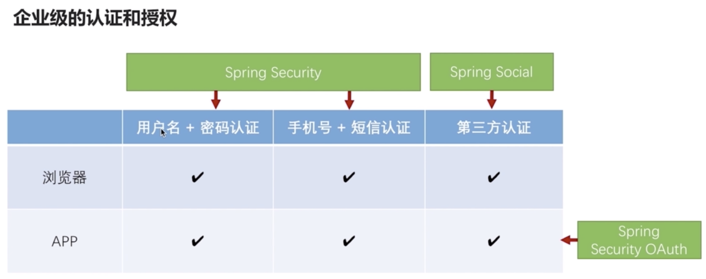
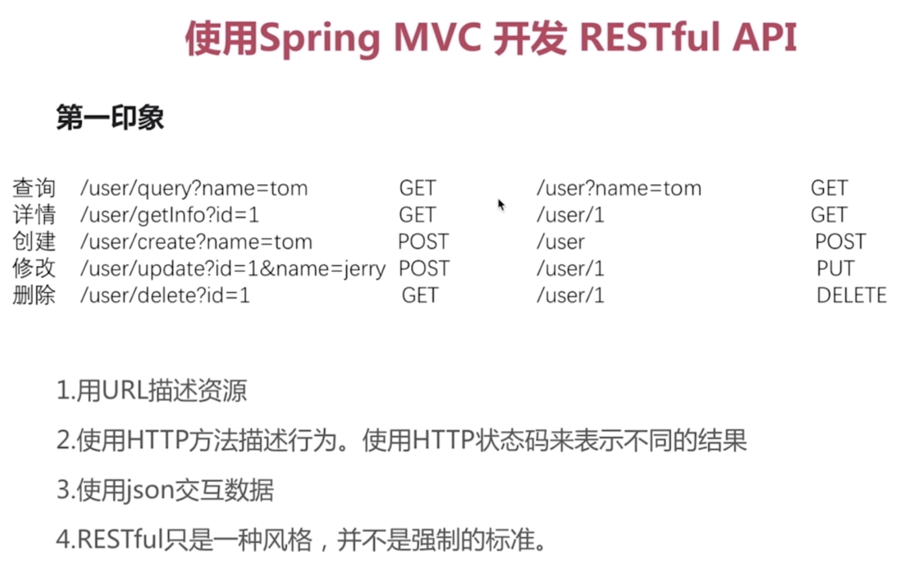
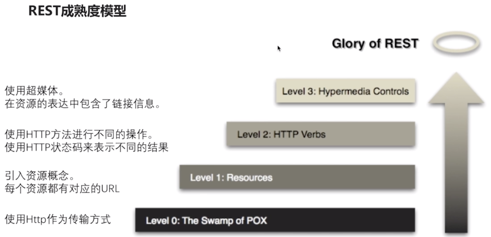
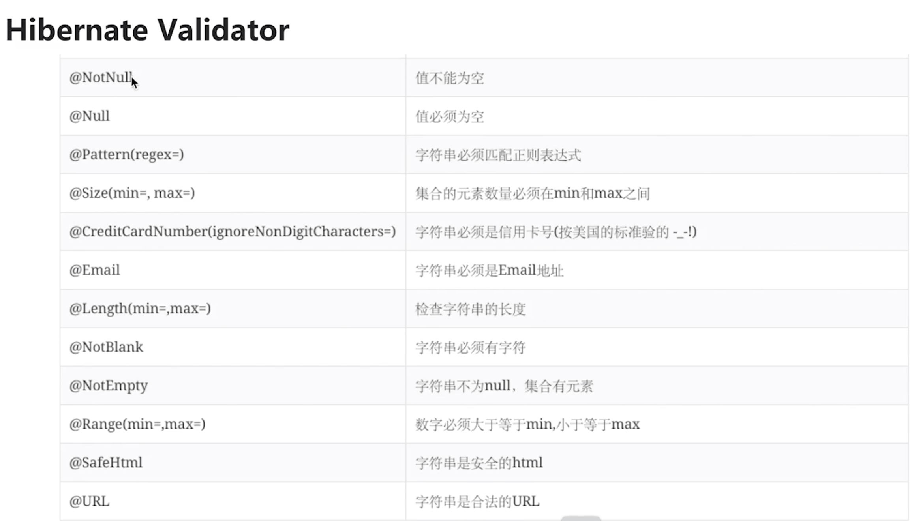
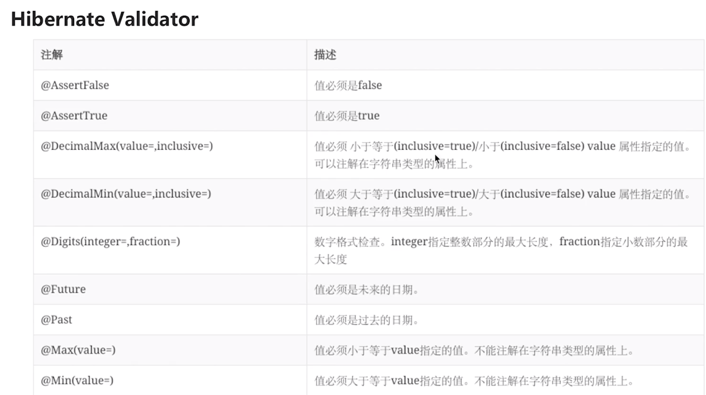
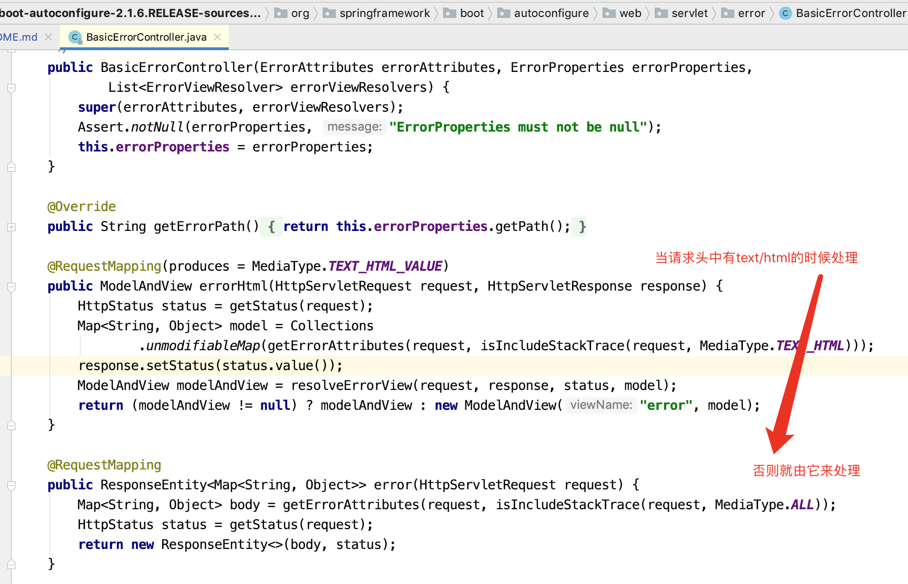
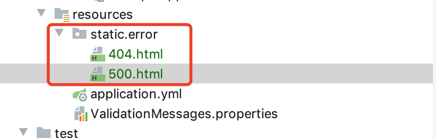
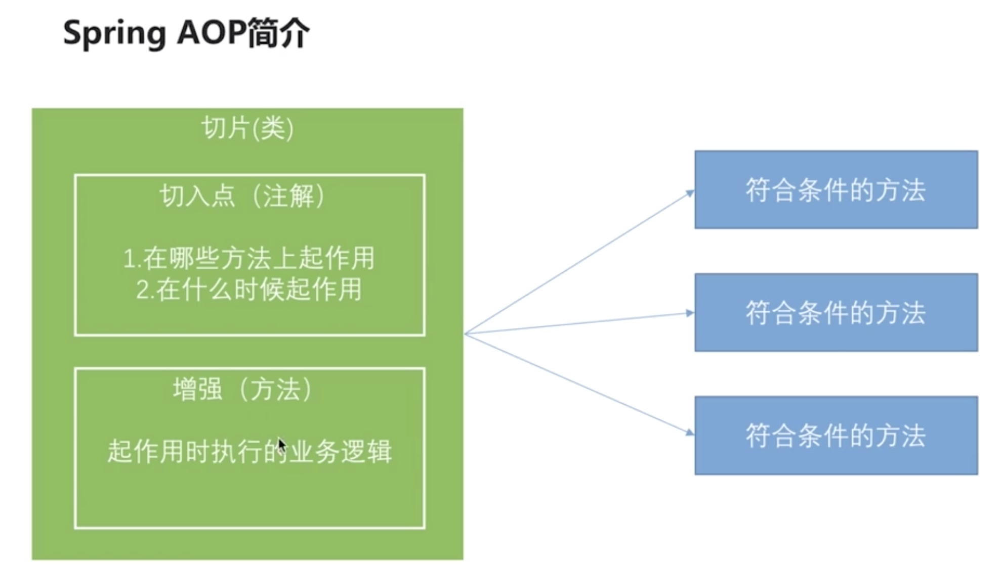
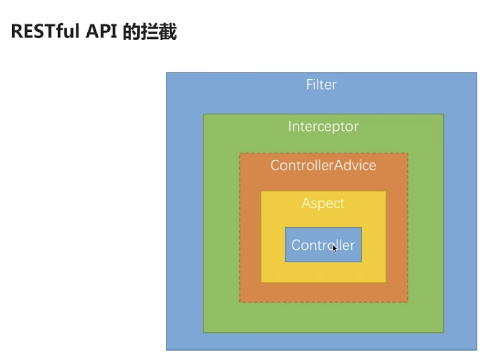

# spring-security-auth-seed
spring security 技术栈 

期望要求：可重用的 企业级的 认证和授权模块

1. 企业级认证和授权
2. 包含 QQ 登录，微信登录常见第三方登录
3. 移动端认证授权
4. 浏览器端认证授权
5. RBAC
6. OAuth2
7. 项目示例
8. spring boot 1.x 和 spring boot 2.x
9. SSO
10. 希望能够封装起来重用，能给别人用
11. 能够支持集群环境，跨应用工作，SESSION攻击，控制用户权限，防护与用户认证相关的攻击
12. 支持多种前端渠道
13. 支持多种认证

## 企业级的认证和授权



## 代码结构介绍

- seed-security-core : 核心业务逻辑
- seed-security-browser : 浏览器安全特定代码
- seed-security-app : app 相关特定代码
- seed-security-examples : 样例程序

## 使用 Spring MVC 开发 Restful API





- 使用 Spring MVC 编写 Restful API
- 使用 Spring MVC 处理其它 web 应用常用的需求和场景
- Restful API 开发常用辅助框架
  - swagger：生成服务文档
  - wiremock：伪造服务
- [RESTful API 设计参考文献列表](https://github.com/aisuhua/restful-api-design-references)
- 还不错的[编程规范](https://xwjie.github.io/rule/)

## Hibernate Validator





## Restful API 错误处理 

### Spring Boot中默认的错误处理机制

错误处理类：`org.springframework.boot.autoconfigure.web.servlet.error.BasicErrorController`



#### 如何添加自定义的 404.html, 500.html



### 自定义异常处理

全局统一异常处理

## Restful API 的拦截

需求：记录所有 API 的处理时间

- 过滤器(Filter)

    自定义filter

    ```java
    package com.fengxuechao.seed.security.web.filter;
    
    import lombok.extern.slf4j.Slf4j;
    import org.springframework.stereotype.Component;
    
    import javax.servlet.*;
    import java.io.IOException;
    
    /**
     * @author fengxuechao
     * @date 2019-08-01
     */
    @Slf4j
    public class TimeFilter implements Filter {
    
        @Override
        public void init(FilterConfig filterConfig) throws ServletException {
            log.info("time filter init");
        }
    
        @Override
        public void doFilter(ServletRequest request, ServletResponse response, FilterChain chain) throws IOException, ServletException {
            log.info("time filter start");
            long start = System.currentTimeMillis();
            chain.doFilter(request,response);
            log.info("time filter:{}ms", System.currentTimeMillis() - start);
            log.info("time filter finish");
        }
    
        @Override
        public void destroy() {
            log.info("time filter destroy");
        }
    }
    ```
    
    如何添加第三方 filter 到过滤器链中去？
    
    ```java
    /**
     * @author fengxuechao
     * @date 2019-08-08
     */
    @Configuration
    public class WebConfig {
    
        /**
         * 第三方 filter 加载方式
         *
         * @return
         */
        @Bean
        public FilterRegistrationBean timeFilter() {
            FilterRegistrationBean registrationBean = new FilterRegistrationBean();
    
            TimeFilter timeFilter = new TimeFilter();
            registrationBean.setFilter(timeFilter);
    
            List<String> urls = new ArrayList<>();
            urls.add("/*");
            registrationBean.setUrlPatterns(urls);
    
            return registrationBean;
        }
    }
    ```

- 拦截器(Interceptor)

    ```java
    /**
     * @author fengxuechao
     * @date 2019-08-01
     */
    @Slf4j
    @Component
    public class TimeInterceptor implements HandlerInterceptor {
    
        /**
         * 这个方法在控制器某个方法调用之前会被调用
         *
         * @param request
         * @param response
         * @param handler
         * @return
         * @throws Exception
         */
        @Override
        public boolean preHandle(HttpServletRequest request, HttpServletResponse response, Object handler)
                throws Exception {
            log.info("preHandle");
    
    //        log.info("处理器类名 {}", ((HandlerMethod) handler).getBean().getClass().getName());
    //        log.info("方法名 {}", ((HandlerMethod) handler).getMethod().getName());
    
            request.setAttribute("startTime", System.currentTimeMillis());
            return true;
        }
    
        /**
         * 在控制器某个方法调用之后会被调用
         * 如果控制器方法调用过程中产生异常，这个方法不会被调用
         *
         * @param request
         * @param response
         * @param handler
         * @param modelAndView
         * @throws Exception
         */
        @Override
        public void postHandle(HttpServletRequest request, HttpServletResponse response, Object handler,
                               ModelAndView modelAndView) throws Exception {
            log.info("postHandle");
            Long start = (Long) request.getAttribute("startTime");
            log.info("time interceptor 耗时:" + (System.currentTimeMillis() - start));
    
        }
    
        /**
         * 不管控制器方法正常调用或者抛出异常，这个方法都会被调用
         *
         * @param request
         * @param response
         * @param handler
         * @param ex
         * @throws Exception
         */
        @Override
        public void afterCompletion(HttpServletRequest request, HttpServletResponse response, Object handler, Exception ex)
                throws Exception {
            log.info("afterCompletion");
            Long start = (Long) request.getAttribute("startTime");
            log.info("time interceptor 耗时:" + (System.currentTimeMillis() - start));
            log.info("ex is " + ex);
    
        }
    
    }
  
    /**
     * @author fengxuechao
     * @date 2019-08-08
     */
    @Configuration
    public class WebConfig implements WebMvcConfigurer {
    
        @Autowired
        private TimeInterceptor timeInterceptor;
    
        /**
         * 添加 Spring 拦截器
         *
         * @param registry
         */
        @Override
        public void addInterceptors(InterceptorRegistry registry) {
            registry.addInterceptor(timeInterceptor);
        }
    }
    ```

- 切片(Aspect)

    
    
    ```java
    /**
     * @author fengxuechao
     * @date 2019-08-21
     */
    @Slf4j
    @Aspect
    @Component
    public class TimeAspect {
    
        /**
         * 使用@Arount 完全覆盖了 @Before，@After @AfterThrowing，所以一般使用 @Around
         *
         * @param pjp
         * @return
         * @throws Throwable
         */
        @Around("execution(* com.fengxuechao.seed.security.web.UserController.*(..))")
        public Object handleControllerMethod(ProceedingJoinPoint pjp) throws Throwable {
    
            log.info("time aspect start");
    
            Object[] args = pjp.getArgs();
            for (Object arg : args) {
                log.info("arg is " + arg);
            }
    
            long start = System.currentTimeMillis();
    
            // 执行被被切(被拦截)的方法
            Object object = pjp.proceed();
    
            log.info("time aspect 耗时:" + (System.currentTimeMillis() - start));
    
            log.info("time aspect end");
    
            return object;
        }
    
    }
    ```
    
过滤器，拦截器，切片的拦截顺序
    


## Restful 文件上传和下载

### 文件上传

### 文件下载


