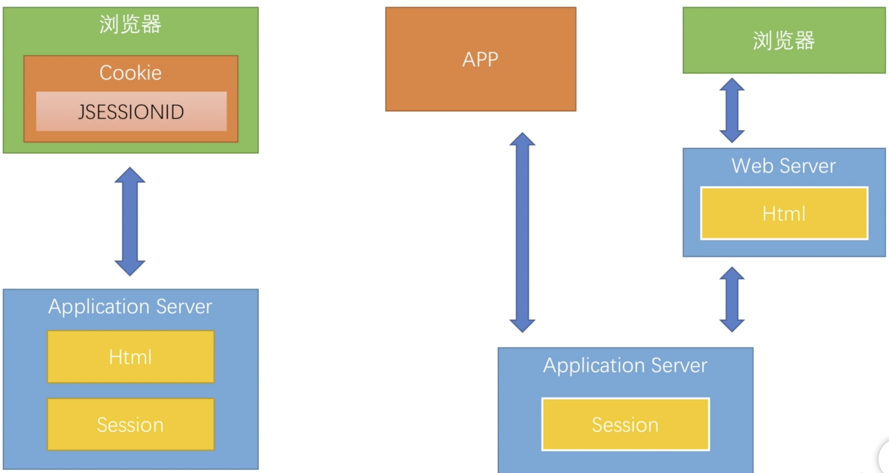
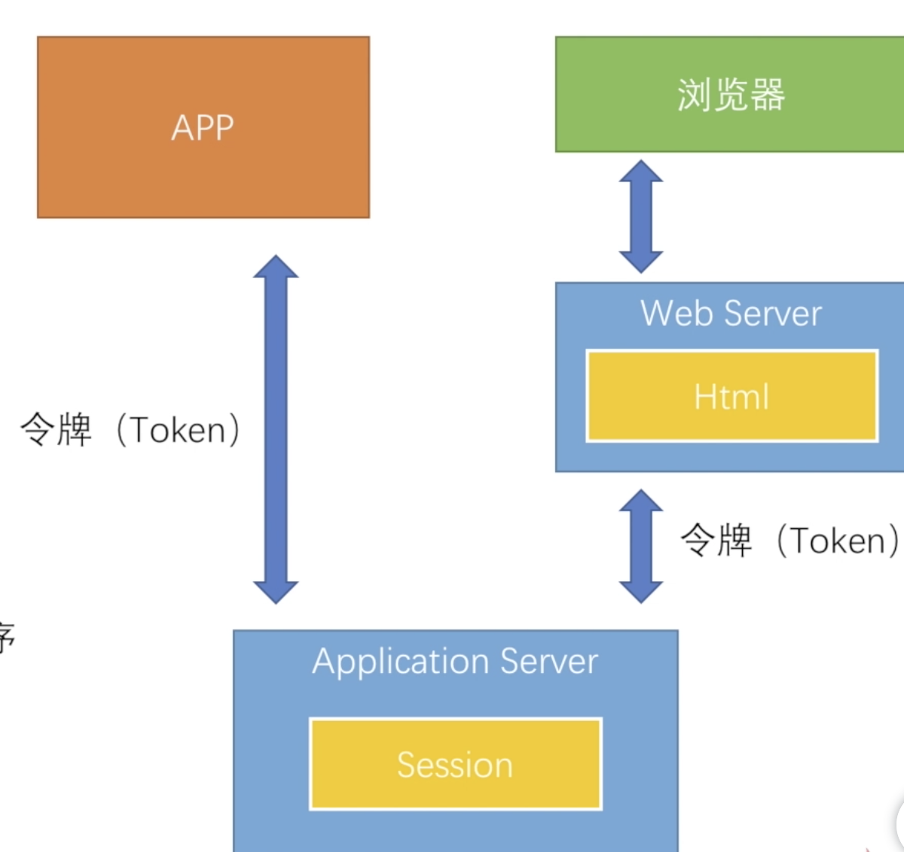
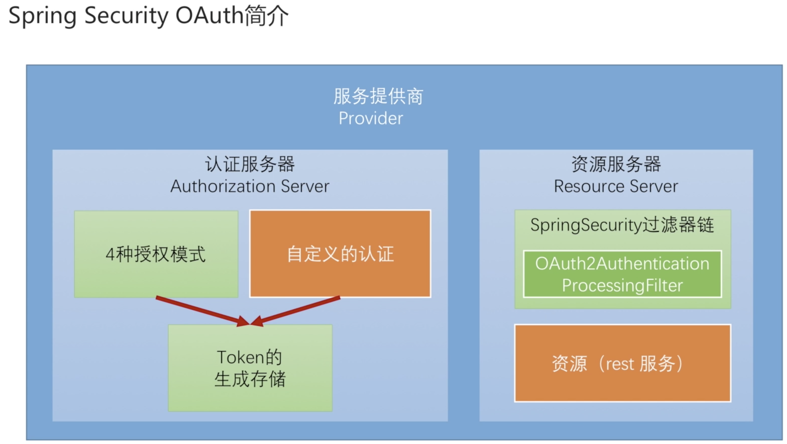

# Spring Security OAuth 开发 APP 认证框架

APP 架构下 Cookie + Session 的缺点：

1. 开发繁琐。

    Cookie 是浏览器内置的功能，开发时不需要针对 Cookie 写太多的代码。而 APP 需要自己去开发去处理 Cookie。
    
2. 安全和客户体验差

3. 有些前端技术不支持 Cookie，如小程序

上图中绿色是 Spring Security OAuth 自带的，而橙色部分才是开发过程中需要我们主要的精力。

## 本文的主要目的

1. 实现一个标准的 OAuth2 协议中的 Provider 角色的主要功能

2. 重构之前的的三种认证方式的代码，使其支持 Token。

3. 高级特性，如Token的生成方式，SSO

## 目录

[实现标准的OAuth服务提供商](实现标准的OAuth服务提供商.md)

[重构用户名密码登录](重构用户名密码登录.md)

[重构短信登录](重构短信登录.md)

[重构社交登录](重构社交登录.md)

