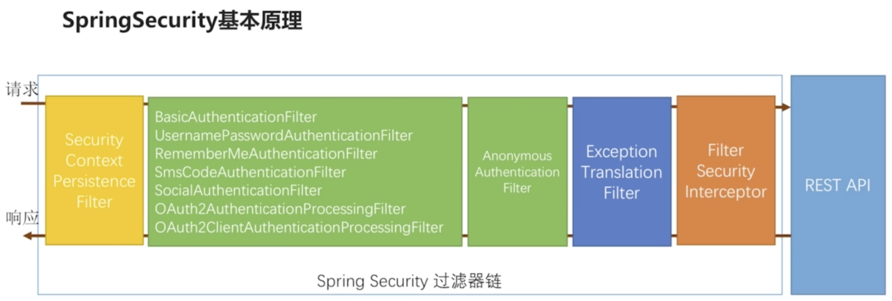

# SpringSecurity控制授权

## 普通用户和公司运营人员的区别

## Spring Security 控制授权基本原理

## 回顾 Spring Security 基本原理

## Spring Security 控制授权的代码架构

其中最核心的 3 个类和接口是：

- FilterSecurityInterceptor: 是整个授权判断流程的主入口，注意它是过滤器不是拦截器。
- AccessDecisionManager: 访问决定的管理者，管理投票者 AccessDecisionVoter 
- AccessDecisionVoter: 投票者

1. AffirmativeBased: 不管有多少个投票人投不过，只要又一个投过，请求就过。
2. UnanimousBased: 不管有多少个投票人投过，只要又一个投不过，请求就不过。
3. ConsensusBased: 计算通过和不过的票数，哪个票数多就按哪个来。

Spring Security 默认使用 AffirmativeBased 。

一个 ConfigAttribute 对应一个 URI 所需要的权限，当前用户所拥有的权限信息包含在 Authentication 中。

## 权限表达式

## 自定义授权代码架构

## 基于数据库 Rbac 数据模型控制权限

