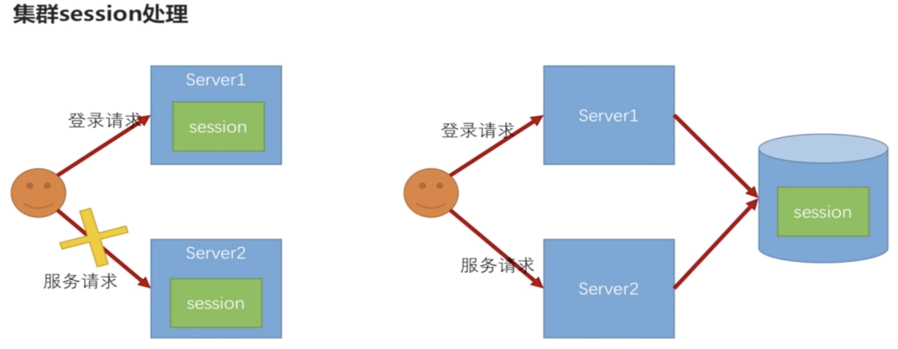

# session 管理

- Session 超时处理
- Session 并发控制
- 集群 Session 管理

## Session 超时处理

Spring Boot 中处理 Session 超时非常简单，只需在 application.properties 中配置

```yaml
# session 超时设置，默认 30 分钟，最小 1 分钟
# 源码：org.springframework.boot.web.embedded.tomcat.TomcatServletWebServerFactory#configureSession
server.servlet.session.timeout=30m
```

1. 为什么默认超时时间为 30 分钟？

    session 源码：`org.springframework.boot.web.servlet.server.Session`

2. 为什么最小超时时间为 1 分钟？

    Spring Boot Tomcat 配置 Session 的源码：`org.springframework.boot.web.embedded.tomcat.TomcatServletWebServerFactory#configureSession`
    
## Session 超时处理和 Session 并发控制的代码

### 抽象的session失效处理器

```java
/**
 * 抽象的session失效处理器
 *
 * @author fengxuechao
 * @date 2019-02-06
 */
public class AbstractSessionStrategy {

    private final Logger logger = LoggerFactory.getLogger(getClass());
    /**
     * 跳转的url
     */
    private String destinationUrl;
    /**
     * 系统配置信息
     */
    private SecurityProperties securityPropertie;
    /**
     * 重定向策略
     */
    private RedirectStrategy redirectStrategy = new DefaultRedirectStrategy();
    /**
     * 跳转前是否创建新的session
     */
    private boolean createNewSession = true;

    private ObjectMapper objectMapper = new ObjectMapper();

    public AbstractSessionStrategy(SecurityProperties securityPropertie) {
        String invalidSessionUrl = securityPropertie.getBrowser().getSession().getSessionInvalidUrl();
        Assert.isTrue(UrlUtils.isValidRedirectUrl(invalidSessionUrl), "url must start with '/' or with 'http(s)'");
        Assert.isTrue(StringUtils.endsWithIgnoreCase(invalidSessionUrl, ".html"), "url must end with '.html'");
        this.destinationUrl = invalidSessionUrl;
        this.securityPropertie = securityPropertie;
    }

    protected void onSessionInvalid(HttpServletRequest request, HttpServletResponse response) throws IOException {

        logger.info("session失效");

        if (createNewSession) {
            request.getSession();
        }

        String sourceUrl = request.getRequestURI();
        String targetUrl;

        if (StringUtils.endsWithIgnoreCase(sourceUrl, ".html")) {
            if (StringUtils.equals(sourceUrl, securityPropertie.getBrowser().getSignInPage())
                    || StringUtils.equals(sourceUrl, securityPropertie.getBrowser().getSignOutUrl())) {
                targetUrl = sourceUrl;
            } else {
                targetUrl = destinationUrl;
            }
            logger.info("跳转到:" + targetUrl);
            redirectStrategy.sendRedirect(request, response, targetUrl);
        } else {
            Object result = buildResponseContent(request);
            response.setStatus(HttpStatus.UNAUTHORIZED.value());
            response.setContentType("application/json;charset=UTF-8");
            response.getWriter().write(objectMapper.writeValueAsString(result));
        }

    }

    /**
     * @param request
     * @return
     */
    protected Object buildResponseContent(HttpServletRequest request) {
        String message = "session已失效";
        if (isConcurrency()) {
            message = message + "，有可能是并发登录导致的";
        }
        return new ResultBean(400, message);
    }

    /**
     * session失效是否是并发导致的
     *
     * @return
     */
    protected boolean isConcurrency() {
        return false;
    }

    /**
     * Determines whether a new session should be created before redirecting (to
     * avoid possible looping issues where the same session ID is sent with the
     * redirected request). Alternatively, ensure that the configured URL does
     * not pass through the {@code SessionManagementFilter}.
     *
     * @param createNewSession defaults to {@code true}.
     */
    public void setCreateNewSession(boolean createNewSession) {
        this.createNewSession = createNewSession;
    }

}
```

### 默认的session失效处理策略

```java
/**
 * 默认的session失效处理策略
 *
 * @author fengxuechao
 * @date 2019-02-06
 */
public class SeedInvalidSessionStrategy extends AbstractSessionStrategy implements InvalidSessionStrategy {

    public SeedInvalidSessionStrategy(SecurityProperties securityProperties) {
        super(securityProperties);
    }

    @Override
    public void onInvalidSessionDetected(HttpServletRequest request, HttpServletResponse response)
            throws IOException {
        onSessionInvalid(request, response);
    }

}
```

### 并发登录导致session失效时，默认的处理策略

```java
/**
 * 并发登录导致session失效时，默认的处理策略
 *
 * @author fengxuechao
 * @date 2019-02-06
 */
public class SeedExpiredSessionStrategy extends AbstractSessionStrategy implements SessionInformationExpiredStrategy {

    public SeedExpiredSessionStrategy(SecurityProperties securityPropertie) {
        super(securityPropertie);
    }

    @Override
    public void onExpiredSessionDetected(SessionInformationExpiredEvent event) throws IOException {
        onSessionInvalid(event.getRequest(), event.getResponse());
    }

    @Override
    protected boolean isConcurrency() {
        return true;
    }

}
```

### Seesion 处理策略初始化

```java
/**
 * 浏览器环境下扩展点配置，配置在这里的bean，业务系统都可以通过声明同类型或同名的bean来覆盖安全
 * 模块默认的配置。
 *
 * @author fengxuechao
 * @date 2019-02-06
 */
@Configuration
public class BrowserSecurityBeanConfig {

    @Autowired
    private SecurityProperties securityProperties;

    /**
     * session失效时的处理策略配置
     *
     * @return
     */
    @Bean
    @ConditionalOnMissingBean(InvalidSessionStrategy.class)
    public InvalidSessionStrategy invalidSessionStrategy() {
        return new SeedInvalidSessionStrategy(securityProperties);
    }

    /**
     * 并发登录导致前一个session失效时的处理策略配置
     *
     * @return
     */
    @Bean
    @ConditionalOnMissingBean(SessionInformationExpiredStrategy.class)
    public SessionInformationExpiredStrategy sessionInformationExpiredStrategy() {
        return new SeedExpiredSessionStrategy(securityProperties);
    }

}
```

### HttpSecurity 配置 Session 管理

```
http.sessionManagement()
    .invalidSessionStrategy(invalidSessionStrategy)
    .maximumSessions(securityProperties.getBrowser().getSession().getMaximumSessions())
    .maxSessionsPreventsLogin(securityProperties.getBrowser().getSession().isMaxSessionsPreventsLogin())
    .expiredSessionStrategy(sessionInformationExpiredStrategy)
```

## 集群 session 管理



