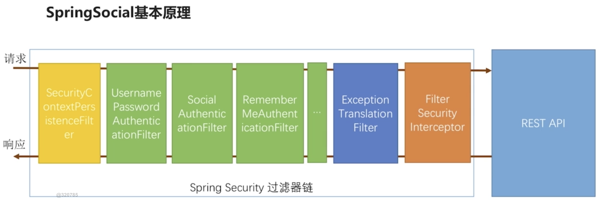
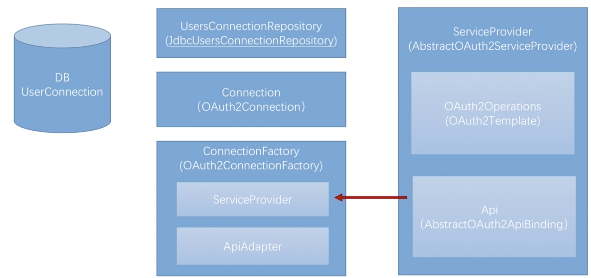

# 使用 Spring Social 开发第三方登录

## OAuth 协议简介

- OAuth 协议要解决的问题
- OAuth 协议中的各个角色
- OAuth 协议运行流程

### OAuth 协议要解决的问题

传统的做法如下：

暴露出的问题：

1. 应用可以访问用户在微信上的所有数据。
2. 用户只有修改密码，才能收回授权。
3. 密码泄漏的可能性大大提高。

OAuth 协议就是为了解决以上问题而诞生的。它的主要思路是用户不再把自己的账号信息告诉第三方 app 而是使用令牌（Token），这时候第三方 app 使用
令牌可以解决上述问题，如下图所示。

### OAuth 协议中的各个角色

- 资源所有者
- 第三方应用
- 认证服务器
- 资源服务器

### OAuth 协议运行流程

上图所示运行流程中的第2步是关键。第三方应用只有得到用户的授权才能使用令牌来获取资源。

根据不同的运行场景可以分为 4 种授权模式。

- 授权码模式(Authorization Code)
- 密码模式(Resource Owner Password Credentials)
- 客户端模式(Client Credentials)
- 简化模式(Implicit)

**授权码模式**

特点：

1. "用户同意授权"这个动作是发生在认证服务器上的，而其它 3 个模式的这个动作是发生在第三方应用上的。
2. 认证服务器在得到"用户同意授权"后返回的并不是令牌而是授权码，第三方应用在得到授权码后要从第三方应用的服务器上在发一个请求使用授权码来获取令牌。

也就是说在授权码模式下要求第三方应用必须得有一个服务器。

## Spring Social 基本原理

用户使用他在服务提供商上的用户基本信息登录了第三方应用。Spring Social 就是把这个流程封装起来并且实现了。
他把整个这个流程封装到了一个叫做 `SocialAuthenticationFilter` 过滤器里面，然后把这个过滤器加到 Spring Security 过滤器里面。

这样当你访问某个请求时，`SocialAuthenticationFilter` 会把这个请求拦截下来，然后带着你走完流程。这个就是 Spring Social 最核心的事情。

### Spring Socal 特有的类和接口介绍

- ServiceProvider: 服务提供商的一个抽象，例如，qq、微信、新浪微博。
- AbstractOAuth2ServiceProvider: 实现 ServiceProvider 的一个抽象类，提供了一些共有方法，如果要实现 qq 的服务商实现继承这个类就可以了。

- OAuth2Operations: 封装了 Oauth2 协议相关的一些操作（第1步-第5步）。
- OAuth2Template: 封装了 Oauth2 协议相关的一些操作的默认实现（第1步-第5步）。

- Api: 实际上没有一个明确的接口，因为每一个服务提供商的用户本信息都是有区别的（第6步）。
- AbstractOAuth2ApiBinding: 更快地帮助我们实现第6步所需要封装的API接口实现。

- Connection: 用于封装前六步获取到的用户信息（第7步）。
- OAuth2Connection: Connection 的实现类 
- ConnectionFactory: 用于创建 Connection 的连接工厂，包含 ServiceProvider
- OAuth2ConnectionFactory: ConnectionFactory 的实现类。
- ApiAdapter: 用于将 ServiceProvider 转换成 Connection 的一个适配器。

- UsersConnectionRepository: 服务提供商的用户和业务系统用户的关联关系的存储器
- JdbcUsersConnectionRepository: UsersConnectionRepository 的实现类

### Spring Social 官网

[https://projects.spring.io/spring-social/](https://projects.spring.io/spring-social/)

在社区项目中有一些实现，例如新浪微博，只需引入就可以使用无需在实现了。

可以看到国内 QQ 和微信就没有，需要自己实现。

## 开发 QQ 登录

[开发QQ登录.md](开发QQ登录.md)

## 开发微信登录

[开发微信登录.md](开发微信登录.md)

## 绑定和解绑处理

[绑定和解绑处理](绑定和解绑处理.md)

## session管理

[session管理](session管理.md)

