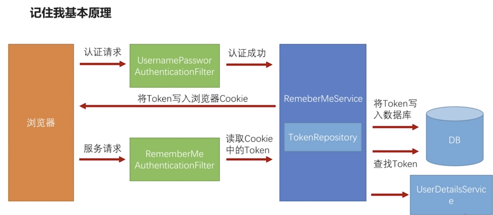
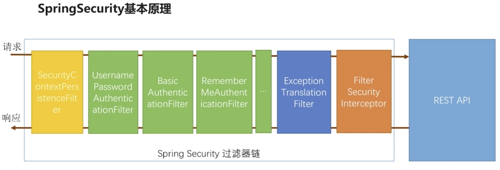

# 实现"记住我功能"

## "记住我" 功能基本原理

流程



过滤器链



## "记住我" 功能具体实现

### 网页添加 "remember-me" 复选框

在表单登录页面合适位置添加以下代码：

**注意**：`name="remember-me"` 是固定的写法

```html
<input name="remember-me" type="checkbox" value="true" />
```

### 配置 `HttpSecurity`

```java
/**
 * 浏览器环境下安全配置主类
 *
 * @author fengxuechao
 * @date 2019-09-09
 */
@Slf4j
@EnableConfigurationProperties(SecurityProperties.class)
@Configuration
public class BrowserSecurityConfig extends WebSecurityConfigurerAdapter {

    @Autowired
    private SecurityProperties securityProperties;

    /**
     * 表单登录成功处理
     */
    @Autowired
    private SeedAuthenticationSuccessHandler seedAuthenticationSuccessHandler;

    /**
     * 表单登录失败处理
     */
    @Autowired
    private SeedAuthenticationFailureHandler seedAuthenticationFailureHandler;

    /**
     * 验证码过滤器
     */
    @Autowired
    private ValidateCodeFilter validateCodeFilter;

    /**
     * 密码保护
     *
     * @return
     */
    @Bean
    public PasswordEncoder passwordEncoder() {
        return new BCryptPasswordEncoder();
    }

    @Autowired
    private MyUserDetailsService userDetailsService;

    @Autowired
    private DataSource dataSource;

    /**
     * remember-me 数据持久化
     *
     * @return
     */
    @Bean
    public PersistentTokenRepository persistentTokenRepository() {
        JdbcTokenRepositoryImpl repository = new JdbcTokenRepositoryImpl();
        repository.setDataSource(dataSource);
        // 系统启动时创建表
        repository.setCreateTableOnStartup(true);
        return repository;
    }

    @Override
    protected void configure(HttpSecurity http) throws Exception {
        // @formatter:off
        //http.httpBasic()
        http
                .addFilterBefore(validateCodeFilter, UsernamePasswordAuthenticationFilter.class)
                .formLogin()
                    .loginPage("/seed-signIn.html")
                    .loginProcessingUrl(SecurityConstants.DEFAULT_SIGN_IN_PROCESSING_URL_FORM)
                    .successHandler(seedAuthenticationSuccessHandler)
                    .failureHandler(seedAuthenticationFailureHandler)
                    .and()
                        // "记住我" 配置
                        .rememberMe()
                        // 数据持久
                        .tokenRepository(persistentTokenRepository())
                        // 过期时间
                        .tokenValiditySeconds(securityProperties.getBrowser().getRememberMeSeconds())
                        // 用户服务
                        .userDetailsService(userDetailsService)
            .and()
                .authorizeRequests()
                .antMatchers(
                        SecurityConstants.DEFAULT_UNAUTHENTICATION_URL,
                        securityProperties.getBrowser().getSignInPage(),
                        "/code/image").permitAll()
                .anyRequest()
                 .authenticated()
            .and()
                .csrf().disable()
        ;
        // @formatter:on
    }
}
```

## "记住我" 功能 Spring Security 源码解析
