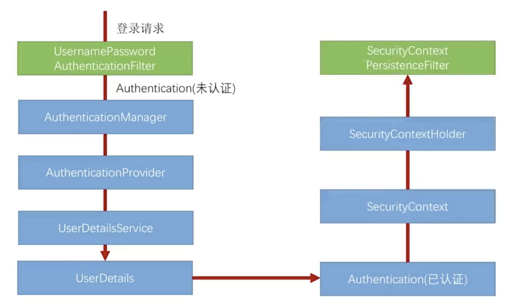
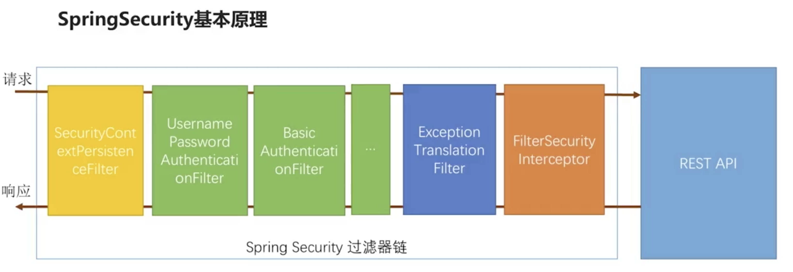

# Spring Security 认证结果如何在多个请求之间共享

`org.springframework.security.web.authentication.AbstractAuthenticationProcessingFilter`

`org.springframework.security.core.context.SecurityContext`

`org.springframework.security.web.context.SecurityContextPersistenceFilter`

当请求进来时检查 session 中是否有 `SecurityContext`, 如果有，就把它拿出来放到线程里，如果没有就空的过去。当请求响应回来以后再次经过该过滤器
的时候，检查线程，如果线程中有 `SecurityContext` ，就把它放到 session 中去