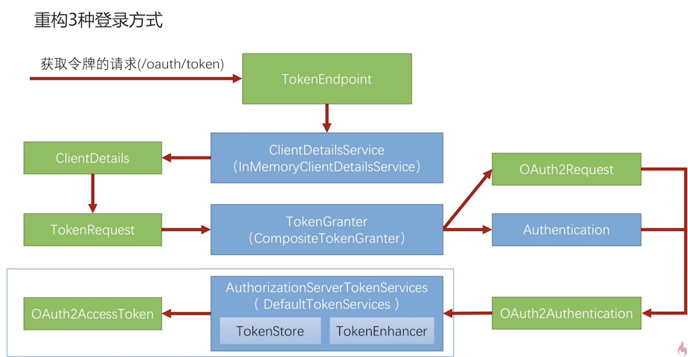
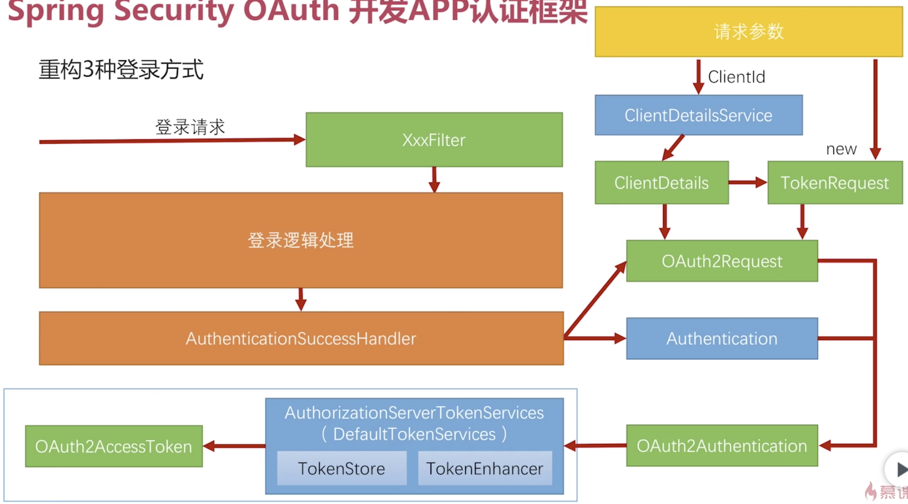

# 重构用户名密码登录

如何重构3种登录方式如下图所示：

我们在介入Spring Security OAuth 原来的代码的话，只需使用上图左下角方框选中的部分就可以了。
从 TokenEndpoint 到 TokenGranter 是不能用的，因为它发出的是获取令牌的请求而我们需要的是登录的请求，然后我们要构造自定义的过滤器去处理
登录的请求。

简而言之，它原先的逻辑是不能用的，仅用蓝色方框选中的内容，就是 TokenService 生成令牌，那么如何使用呢？详见下图。

