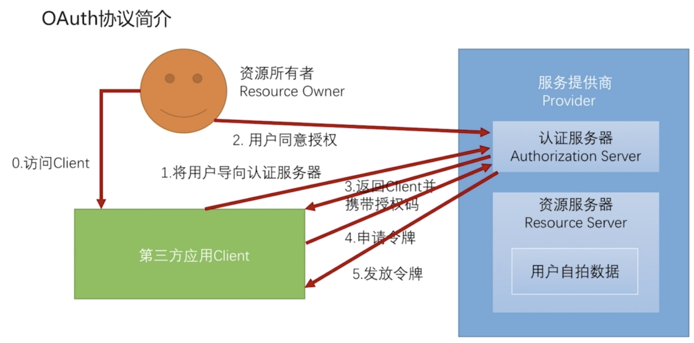
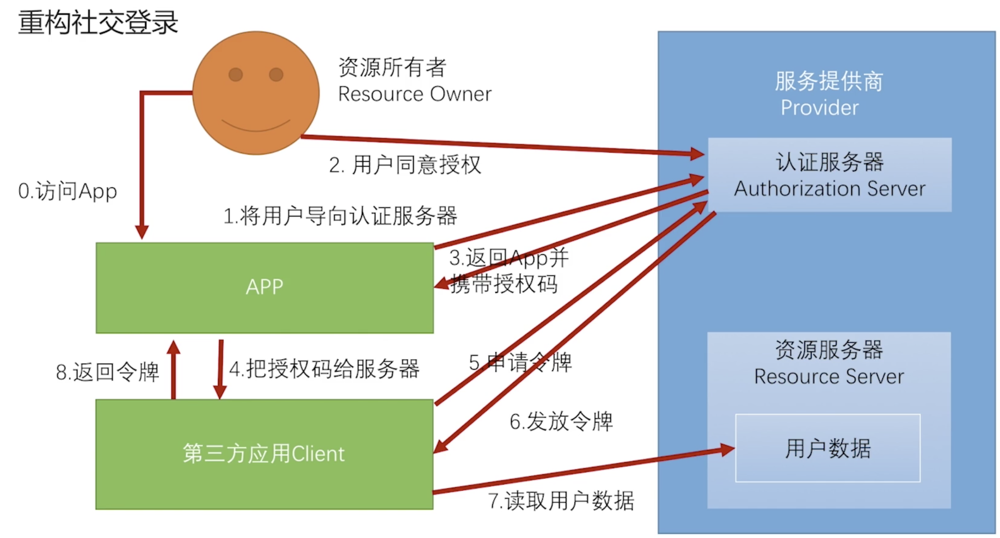

# 重构社交登录

## 回顾 OAuth 流程

## APP 下的架构

### 简化模式

### 授权码模式

## 代码

1. `com.fengxuechao.seed.security.app.authentication.openid.OpenIdAuthenticationToken`
2. `com.fengxuechao.seed.security.app.authentication.openid.OpenIdAuthenticationFilter`
3. `com.fengxuechao.seed.security.app.authentication.openid.OpenIdAuthenticationProvider`
4. `com.fengxuechao.seed.security.app.authentication.openid.OpenIdAuthenticationSecurityConfig`
5. `com.fengxuechao.seed.security.server.SeedResourceServerConfig` 
6. `com.fengxuechao.seed.security.social.support.SocialAuthenticationFilterPostProcessor` 

